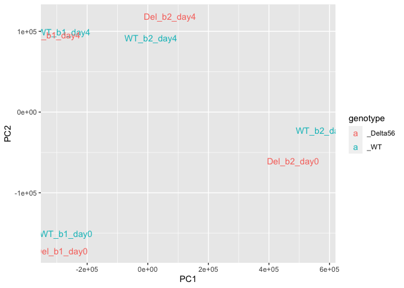
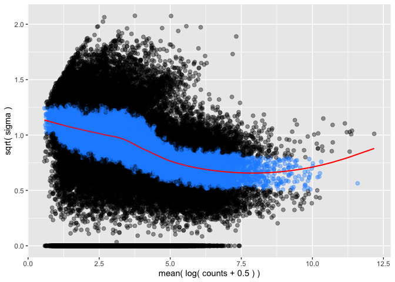
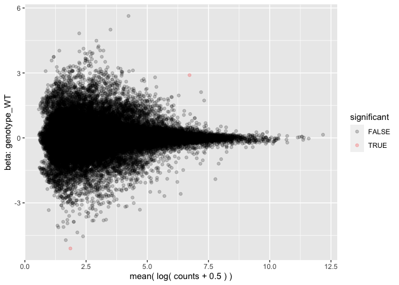
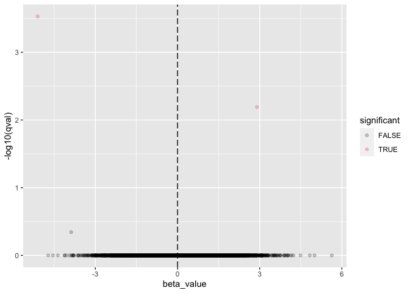
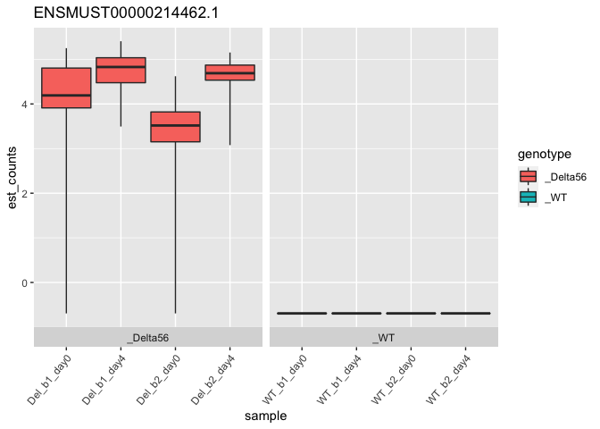
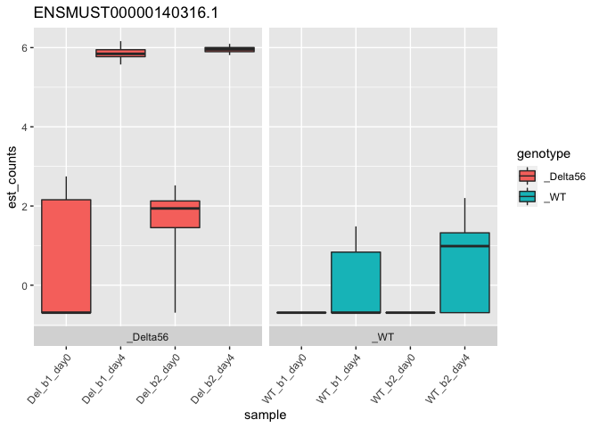

RNA seq DE analysis pipeline
================

Bare bones of scripts for kallisto and sleuth for quantifying RNA seq
data. Working with 8 samples from SRX672303 sra project.

Study: CTCF establishes discrete functional chromatin domains at the Hox
clusters during differentiation

Sample info: 4 samples wild type, 4 samples knockout for CTCF site in
HoxA cluster taken at Day 0 and Day 4 of differentiation

    Sample 1 SRR1539361 Day0.WT.b1 [RNA-Seq]; Mus musculus; RNA-Seq
    Sample 2 SRR1539362 Day0.WT.b2 [RNA-Seq]; Mus musculus; RNA-Seq
    Sample 3 SRR1539363 Day0.Δ5|6.b1 [RNA-Seq]; Mus musculus; RNA-Seq
    Sample 4 SRR1539364  Day0.Δ5|6.b2 [RNA-Seq]; Mus musculus; RNA-Seq
    Sample 5 SRR1539366 Day4.WT.b1 [RNA-Seq]; Mus musculus; RNA-Seq
    Sample 6 SRR1539367 Day4.WT.b2 [RNA-Seq]; Mus musculus; RNA-Seq
    Sample 7 SRR1539368 Day4.Δ5|6.b1 [RNA-Seq]; Mus musculus; RNA-Seq
    Sample 8 SRR1539369  Day4.Δ5|6.b2 [RNA-Seq]; Mus musculus; RNA-Seq

Going to use kallisto to first generate a transcriptome index and then
quantify counts.First activate conda environment for kallisto. This
seems to be necessary workaround because kalisto executable doesn’t
output the h5 files needed for sleuth on mac for some reason.

    source activate kallisto # Conda env named kallisto with kallisto and hd5f modules

Run kallisto as follows

    kallisto index -i genome_index.idx -k 31 Mus_musculus.GRCm38.cdna.all.fa
    
    kallisto quant -i genome_index.idx -o output -b 30 --single -l 180 -s 20 sample_x.fastq 

(Optional) perform kallisto quant on all of the Fastq dumps in a
directory with

    for i in *.fastq
    do
    kallisto quant -i genome_index.idx -o  eval 'echo "$i""_dir"' -b 30 --single -l 180 -s 20 i
    done

Load in required packages for sleuth to work in R

``` r
library("sleuth")
library("biomaRt")
```

Get the correct ensembl gene names from the mouse transcriptome for
using in the sleuth shiny app

``` r
tx2gene <- function(){
  mart <- biomaRt::useMart(biomart = "ensembl", dataset = "mmusculus_gene_ensembl")
    t2g <- biomaRt::getBM(attributes = c("ensembl_transcript_id", "ensembl_gene_id",
                "external_gene_name"), mart = mart)
    t2g <- dplyr::rename(t2g, target_id = ensembl_transcript_id,
                    ens_gene = ensembl_gene_id, ext_gene = external_gene_name)
    return(t2g)
    }

t2g <- tx2gene()
```

Next pass kallistos to R for sleuth. Reading in the kalisto abundance
data into R Generate a simple sleuth model s2c of WT vs KO DE as a
starting point for data analysis

``` r
#setwd("~/Documents/RNA seq/")
samples<-read.table('CTCF_RNA_Seq.tsv',sep='\t',header=TRUE,stringsAsFactors = FALSE)
samples
```

    ##        sample genotype  day                      path
    ## 1  WT_b1_day0      _WT Zero kallisto_outputs/sample 1
    ## 2  WT_b2_day0      _WT Zero kallisto_outputs/sample 2
    ## 3 Del_b1_day0 _Delta56 Zero kallisto_outputs/sample 3
    ## 4 Del_b2_day0 _Delta56 Zero kallisto_outputs/sample 4
    ## 5  WT_b1_day4      _WT Four kallisto_outputs/sample 5
    ## 6  WT_b2_day4      _WT Four kallisto_outputs/sample 6
    ## 7 Del_b1_day4 _Delta56 Four kallisto_outputs/sample 7
    ## 8 Del_b2_day4 _Delta56 Four kallisto_outputs/sample 8

Next generate the different models we will test with sleuth A full model
(Days + Genotype) and a reduced model (Days)

    ## Warning in check_num_cores(num_cores): It appears that you are running Sleuth from within Rstudio.
    ## Because of concerns with forking processes from a GUI, 'num_cores' is being set to 1.
    ## If you wish to take advantage of multiple cores, please consider running sleuth from the command line.

    ## reading in kallisto results

    ## dropping unused factor levels

    ## ........

    ## Warning in check_target_mapping(tmp_names, target_mapping, !
    ## is.null(aggregation_column)): intersection between target_id from kallisto
    ## runs and the target_mapping is empty. attempted to fix problem by removing .N
    ## from target_id, then merging back into target_mapping. please check
    ## obj$target_mapping to ensure this new mapping is correct.

    ## normalizing est_counts
    ## 39634 targets passed the filter
    ## normalizing tpm
    ## merging in metadata
    ## summarizing bootstraps
    ## ........
    ## fitting measurement error models
    ## shrinkage estimation
    ## 1 NA values were found during variance shrinkage estimation due to mean observation values outside of the range used for the LOESS fit.
    ## The LOESS fit will be repeated using exact computation of the fitted surface to extrapolate the missing values.
    ## These are the target ids with NA values: ENSMUST00000082402.1
    ## computing variance of betas
    ## fitting measurement error models
    ## shrinkage estimation
    ## 1 NA values were found during variance shrinkage estimation due to mean observation values outside of the range used for the LOESS fit.
    ## The LOESS fit will be repeated using exact computation of the fitted surface to extrapolate the missing values.
    ## These are the target ids with NA values: ENSMUST00000082402.1
    ## computing variance of betas

<!-- --><!-- --><!-- --><!-- -->

``` r
sleuth_table <- sleuth_results(so, 'genotype_WT', 'wt', show_all = FALSE)
sleuth_significant <- dplyr::filter(sleuth_table, qval <= 0.5)
head(sleuth_significant, 20)
```

    ##             ens_gene ext_gene             target_id         pval         qval
    ## 1 ENSMUSG00000042787     Exog  ENSMUST00000214462.1 7.456915e-09 0.0002955474
    ## 2 ENSMUSG00000020176    Grb10 ENSMUST00000093321.11 3.244773e-07 0.0064301665
    ## 3 ENSMUSG00000038236    Hoxa7  ENSMUST00000140316.1 3.432165e-05 0.4534347033
    ##           b      se_b mean_obs  var_obs  tech_var   sigma_sq smooth_sigma_sq
    ## 1 -5.105472 0.8832543 1.859589 7.628649 0.3443816 -0.1602739       1.2158947
    ## 2  2.901080 0.5678765 6.724389 2.946901 0.1589012  0.4860663       0.2059814
    ## 3 -3.881079 0.9368441 1.997078 6.849740 0.5763562  0.0282494       1.1789974
    ##   final_sigma_sq
    ## 1      1.2158947
    ## 2      0.4860663
    ## 3      1.1789974

``` r
plot_bootstrap(so, "ENSMUST00000214462.1", units = "est_counts", color_by = "genotype")
```

<!-- -->

``` r
plot_bootstrap(so, "ENSMUST00000140316.1", units = "est_counts", color_by = "genotype")
```

<!-- -->

Note that the `echo = FALSE` parameter was added to the code chunk to
prevent printing of the R code that generated the plot.
